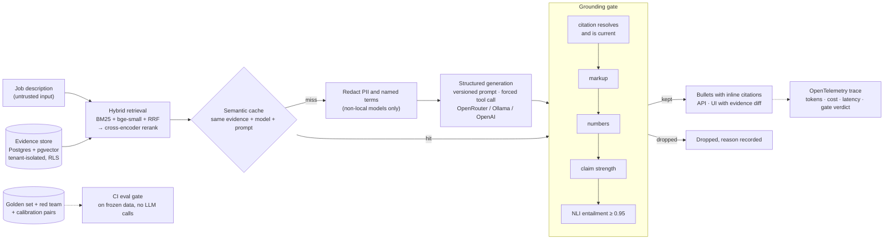

# evidence-grounded-resume-engine

> Résumé generation where every claim cites a verified evidence record — and a claim its evidence does not support is rejected, never smoothed over. The fabrication rate is measured, not promised.

[](https://github.com/Pranay777777/evidence-grounded-resume-engine/actions/workflows/ci.yml)


[](LICENSE)

**Live demo:** <https://huggingface.co/spaces/7Pranay77/evidence-grounded-resume-engine> - a read-only Hugging Face Space over a synthetic
career ([ADR-020](docs/adr/0020-public-demo.md)). The samples replay drafts
real models wrote and judge them live, with no model call.

## The problem

Asked to tailor a résumé to a job description, a language model is under
constant pressure to fabricate: "used Databricks" becomes "led a Databricks
migration", a percentage appears from nowhere, the one skill the posting
wants turns up in a bullet. Each reads well, and each is something the
candidate has to defend in an interview. Prompting for faithfulness lowers
the rate. Nothing in a typical system measures it, and nothing makes it zero.

## The constraint

The whole system is built around one rule - [ADR-001](docs/adr/0001-grounding-constraint.md):

1. **Evidence is the only source of fact.** Every checkable claim traces to
   a stored, individually verified evidence record with a stable ID.
2. **Citation is structural.** Each bullet carries its `evidence_ids` as
   validated data. A bullet without citations is invalid output.
3. **Citations are checked.** A verifier decides whether the cited evidence
   *entails* the bullet - citing a real record does not make a claim true.
4. **Rejection means removal.** A bullet that fails verification is dropped
   with its reason recorded - never rewritten until it passes.
5. **Shorter and true beats complete and false.** If nothing survives, the
   system returns nothing and says why.
6. **The failure rate is published** and gated in CI.

## Architecture



The job description is untrusted input throughout. The red-team suite
assumes the model *obeyed* each injection and checks that the gate still
drops what it wrote. Decisions are recorded as ADRs in [docs/adr](docs/adr).

## Results

Measured numbers only; each links to the committed report that produced it.

| Metric | Value | How measured |
|---|---|---|
| Fabrication rate (output) | **0%** of kept bullets unsupported (0 of 53; 95% upper bound 7%) - before the gate: 23% | [golden set](docs/results/eval.md): 110 human-labelled bullets of 213, from cohere/north-mini-code:free, nvidia/nemotron-3-super-120b-a12b:free, poolside/laguna-s-2.1:free; [ADR-010](docs/adr/0010-golden-set-and-evals.md) |
| Verifier, full gate at 0.95 | **0% false accept · 0% false reject** (NLI alone: 15% · 0%) | [calibration](docs/results/verifier-calibration.md): 21 labelled pairs incl. 3 real embellished bullets; in-sample, see ADR-008 |
| Prompt-injection suite | **100%** with `generate-v2` (v1: 94%) | [34 payloads](docs/results/redteam.md) mapped to OWASP LLM Top 10 2026; every payload assumed obeyed |
| Retrieval, hybrid bge-small + rerank | **Recall@1 0.80 · Recall@10 1.00 · MRR 0.97** (BM25: 0.57 · 0.93 · 0.75) | [ablation](docs/results/retrieval-ablation.md), synthetic benchmark of 20 queries |
| Model comparison | kept by gate: Nemotron 57% · Poolside 49% · Cohere 43% | [3 free models](docs/results/model-comparison.md), same 20 JDs and evidence |
| Semantic cache | **50% hits on repeated requests, 0% false hits** at 0.90 | [24 labelled pairs](docs/results/semantic-cache.md), no model calls |
| Improvement curve | false accept 31% → 15% → 0% across three changes | [before/after per change](docs/results/improvement-curve.md) |

## Roadmap

- [x] Repository, CI gates, and the grounding constraint (ADR-001)
- [x] Evidence store — Postgres + pgvector, atomic versioned records ([ADR-002](docs/adr/0002-evidence-model.md)); real records loading in progress
- [x] Evidence API and admin UI for adding and verifying records ([ADR-003](docs/adr/0003-evidence-api-and-admin.md))
- [x] Embedding and chunking pipeline, with the strategy documented ([ADR-004](docs/adr/0004-chunking-and-embeddings.md))
- [x] Hybrid retrieval — BM25 + dense + RRF ([ADR-005](docs/adr/0005-hybrid-retrieval.md))
- [x] Cross-encoder reranking and a recall@k ablation harness ([ADR-006](docs/adr/0006-reranking-and-ablation.md))
- [x] Structured generation with mandatory `evidence_ids` ([ADR-007](docs/adr/0007-structured-generation.md))
- [x] Hard grounding checks ([ADR-008](docs/adr/0008-hard-grounding.md)) and the entailment verifier ([ADR-009](docs/adr/0009-entailment-verifier.md))
- [ ] Golden set of 100+ human-labelled generations — collection and labelling tools shipped ([ADR-010](docs/adr/0010-golden-set-and-evals.md)); labels in progress
- [x] Eval harness — fabrication, gate errors, citation P/R, keyword coverage, tone; `--check` limits
- [x] CI regression gate — `make eval` on every push, on frozen data, never calling an LLM ([ADR-011](docs/adr/0011-ci-regression-gate.md))
- [x] Prompt registry ([ADR-012](docs/adr/0012-prompt-registry-and-model-adapters.md)), model adapters with a model comparison, and a semantic cache that still gates every draft ([ADR-013](docs/adr/0013-semantic-cache.md))
- [x] Prompt-injection red team mapped to OWASP LLM Top 10 2026 ([ADR-014](docs/adr/0014-red-team-suite.md)), redaction before external calls and a local-only mode ([ADR-015](docs/adr/0015-redaction-and-local-mode.md))
- [x] Generation API: API keys, per-key budgets, rate limits, circuit breaker ([ADR-016](docs/adr/0016-generation-api.md))
- [x] JWT scopes and tenant isolation enforced in the ORM and by Postgres row-level security ([ADR-017](docs/adr/0017-auth-and-tenancy.md))
- [x] OpenTelemetry traces per draft: tokens, cost, per-stage latency, the gate's verdict ([ADR-018](docs/adr/0018-observability.md))
- [x] Draft UI with inline citations, evidence on hover and a base-vs-tailored diff ([ADR-019](docs/adr/0019-draft-ui.md))
- [x] Public read-only demo on Hugging Face Spaces and release v1.0.0 ([ADR-020](docs/adr/0020-public-demo.md))

## Development

```bash
pip install -e ".[dev,embeddings]"
docker compose up -d --wait db && python -m grounded.migrate
python -m grounded.evidence load evidence/drafts/lakehouse.yaml
python -m grounded.retrieval index
python -m grounded         # UI at /ui, admin at /admin, API docs at /docs
```

Each `make` target is a shortcut for one of these commands (`make help`
lists them); Windows Git Bash has no `make`, so the commands are given
directly. To run the public demo locally: `DEMO=true python -m grounded.demo`.

Gates: `ruff`, `mypy --strict`, `pytest` (70% floor), `gitleaks` over every
ref, and `pip-audit`. CI runs on Ubuntu (Python 3.11 and 3.12) and Windows
(3.12). An eval job re-measures the grounding gate on every push (`make eval`).

## Related

[metadata-driven-lakehouse](https://github.com/Pranay777777/metadata-driven-lakehouse)
— the same author's config-driven data platform; its ADRs set the standard
this project's decisions are written to.

## License

MIT — see [LICENSE](LICENSE).
